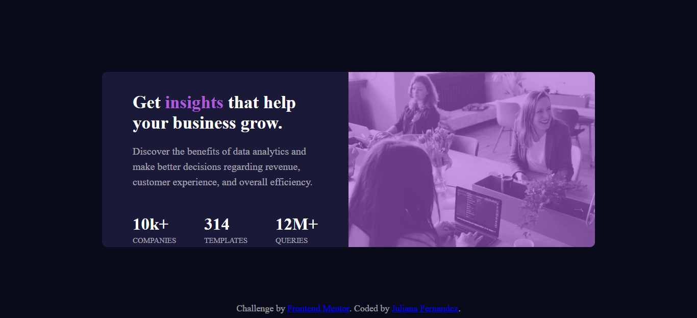

<h1 align="center">
   Analitycs Data Page
</h1>

<h1 align="center">

  </h1>

<h3 align="center">
    <a href="https://data-analitycs-page.netlify.app/">Access demo page</a>
<h3 >

# Index

- [About](#-about)
- [Technologies used](#-technologies-used)
- [How to download the project](#-how-to-download-the-project)

## 🔖&nbsp; About

The Analitycs Data Page is a challenge from Frontend Mentor that consist in  build out this card component and get it looking as close to the design as possible Using only with HTML and CSS. It is a project created in order to put into practice all the HTML e CSS knowledge including
  *flexbox*, and *responsiveness* properties.

---

## 🚀 Technologies used

The project was developed using the following technologies

- Semantic HTML5 markup
- CSS custom properties
- Flexbox
- Mobile-first workflow
- VS Code

---

## 🗂 How to download the project

    - Clone the repository
    - Enter directory
    - Install dependencies
    - Start project
   
---

Developed ❤ by Juliana Fernandez

